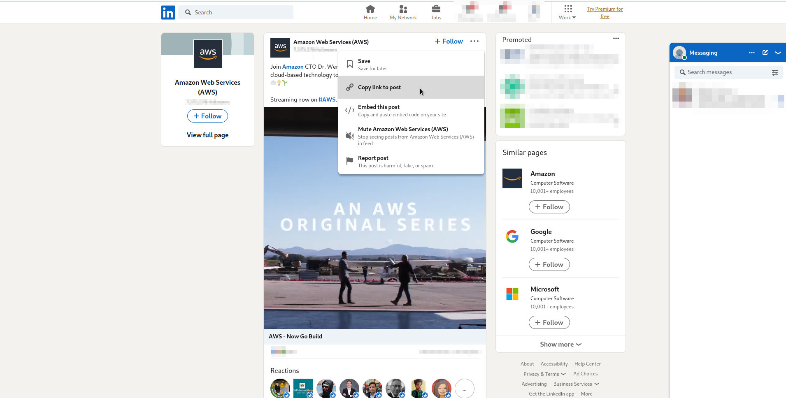

<div align="center"><h1>Linkedin post date</h1><div>
 
 
<hr>
<b>Displays the date of a Linkedin post in the page and the web console. Based on <a href="https://dfir.blog/tinkering-with-tiktok-timestamps/" target="_blank">the article by Ryan Benson</a>.</b>
</div></div>
<br>

## diffusion's date of a post (web-extention)

Download the sources then unzip in the folder of your choice. In the Firefox browser, type the url : <a href="about:debugging#/runtime/this-firefox" target="_blank">about:debugging</a> then click on the button "load temporary Add-on" and select any file present in the folder <i><b>linkedin-post-date</b></i>.

Once the Add-on is loaded, the dates will be automatically changed on the post page (see below)<br>
<br>

<br><br>

## diffusion's date of a post (web console)
<div style="margin-bottom: 20px;">
It is essential to open the page of the post alone (and not via the "Posts" tab of the account homepage). To do this, simply copy and open the post url via the menu at the top right of the post (see below)
<div>
<br>

<br><br>
<div style="margin-bottom: 20px;margin-top: 20px;">
Then open the console, and copy/paste the code below to display the date of the post. 
</div>
<br>
<div>

```console
// convert linkedin postID in unix timestamp
// https://dfir.blog/tinkering-with-tiktok-timestamps/

if ((/([0-9]{19})/).exec(document.location.href).pop().length === 19) {
    setTimeout(() => {
        let timestampLinkedinPost = () => {
            let postId = (/([0-9]{19})/).exec(document.location.href).pop(),
                timestamp = parseInt(BigInt(postId).toString(2).slice(0, 41), 2),
                dateObject = new Date(timestamp),
                parsedDate = dateObject.toLocaleDateString("en-EN") + `  ${dateObject.getHours()}h${dateObject.getMinutes()}m${dateObject.getSeconds()}s`;
            console.log(`PostID ${postId} - ${parsedDate} (unix : ${timestamp})`);
            // show the full date in the DOM 
            if (document.querySelector('main').querySelector('li-icon').parentNode.type !== "button") {
                document.querySelector('main').querySelector('li-icon').parentNode.innerHTML = `${parsedDate} (unix : ${timestamp})`;
            }
        }

        timestampLinkedinPost();
    }, 1000)
}
```
<div style="margin-bottom: 20px;margin-top: 20px;">
Example of result:
</div><br>

```console
PostID 6975133144530247680 - 12/09/2022 18h48m53s (unix : 1663001333363)
```
